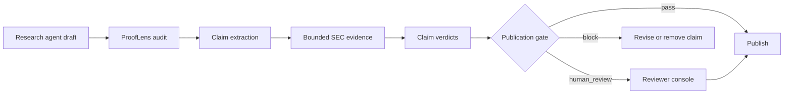

# ProofLens for Agents

ProofLens is a claim-level evidence gate for research agents. Before an agent publishes a company-research answer, it submits its draft to ProofLens. The service separates factual claims from inference, retrieves bounded SEC evidence, and returns one machine-readable decision: `pass`, `human_review`, or `block`.

The MVP supports AMZN, MRVL, and NVDA with a dated twelve-record SEC evidence snapshot. It is a research and evaluation prototype, not an investment adviser.

## Why To-Agent

Most research assistants focus on generating more text. ProofLens occupies a different layer: reliability infrastructure that agents call before delivery. Its primary product surface is the machine contract; the web console makes failures observable and lets a human reviewer override a verdict.



## Product surfaces

- `POST /api/audit`: strict JSON interface for agents.
- `GET /api/evidence`: inspect the bounded primary-source corpus.
- `npm run mcp`: local MCP server with `audit_research_draft` and `list_evidence_sources`.
- Browser WebMCP: progressively exposes `audit_research_draft` and updates the visible console when supported.
- Trace Console: run an audit, inspect evidence, override verdicts, record confidence, and export JSON.

## Quick start

```bash
npm install
npm run dev
```

Open `http://localhost:3000`.

Run the engine and MCP contract checks:

```bash
npm run test:engine
npm run test:mcp
```

Start the MCP server:

```bash
npm run mcp
```

Example Codex/Claude Desktop-style MCP configuration:

```json
{
  "mcpServers": {
    "prooflens": {
      "command": "npm",
      "args": ["run", "mcp"],
      "cwd": "/absolute/path/to/prooflens-agent"
    }
  }
}
```

## API example

```bash
curl -X POST http://localhost:3000/api/audit \
  -H "Content-Type: application/json" \
  -d '{
    "language": "en",
    "agentId": "equity_research_agent",
    "ticker": "NVDA",
    "question": "Verify Q1 FY2025 growth claims",
    "draftText": "NVIDIA Data Center revenue was $22.6 billion, up 427%.",
    "preConfidence": 86
  }'
```

The response contains dated evidence, claim-level verdicts, a verified brief, and the publication gate. Invalid or under-specified requests receive a structured 4xx response.

## Evaluation status

The repository includes a 120-row annotation sheet. Twelve rows are seed expectations for regression testing; they are explicitly marked `seed-not-human-labeled`. The remaining 108 rows remain blank until two human annotators complete them. No user-study outcome or model-quality target is represented as achieved before collection.

- [PRD](docs/PRD.md)
- [Evaluation plan](docs/EVALUATION.md)
- [User research kit](docs/USER_RESEARCH.md)
- [Chinese portfolio case](docs/PORTFOLIO_CASE_ZH.md)
- [English portfolio case](docs/PORTFOLIO_CASE_EN.md)
- [Interview pitch](docs/INTERVIEW_PITCH.md)

## Privacy and limitations

The public workflow does not persist raw drafts. Anonymous telemetry stores only run metadata when the database binding is available. The current deterministic engine is deliberately bounded and cannot establish truth outside the included corpus. Production use would add document ingestion, hybrid retrieval, model-assisted judgment, authentication, rate limiting, and a larger independently labeled benchmark.

All source materials are linked to SEC filings. Users must review the underlying filing before relying on an output.
